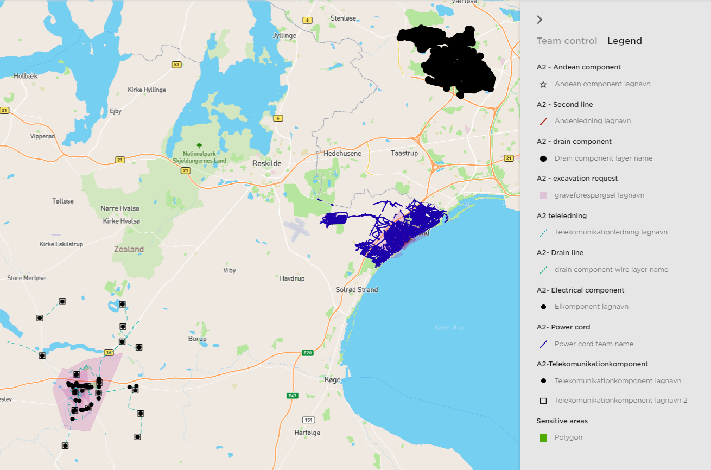

# mapbox-legend-symbol
Mapbox Legend Symbol

This module is showing legend symbol control which is able to create legend panel from mapbox layer style.

## Installation:

```bash
npm install git+https://github.com/yogesh20kumar/mapbox-legend-symbol.git
```



## Usage
Here is an example using VUE/Nuxtjs. In the example below `map` is a instance of a mapbox-gl map and `layer` is the JSON representation of the layer you want to get a map symbol for.

```javascript
<v-treeview               
    item-disabled="locked"
    :items="legends"               
    open-on-click
    hoverable
>
    <template v-slot:prepend="{ item }">
        <div class="set-backgrnd mr-1 text-center" v-html="item.icon"></div>
    </template>
    <template v-slot:label="{ item }">                   
        <div class="font-weight-medium">{{ item.id }}</div>
    </template>
</v-treeview>   

import mapboxgl from "mapbox-gl"
import mapboxLegendSymbol from "mapbox-legend-symbol"
export default { 
  data() {
    return {
      legends: []
    };
  },
  mounted() {
    this.getLegends()
  },
  methods: {
    getLegends() {
      //======================== Initialize Mapbox ====================//
      mapboxgl.accessToken = ''; // mapbox access token
			var map = new mapboxgl.Map({
				container: "map",
				style: "mapbox://styles/mapbox/light-v10",				
				minZoom: 0,
				zoom: 6.23,
                center: [9.5018, 56.2639],   
				antialias: true
      }); 
      //======================= Map Layer Data =====================//
      map.on('load', function() {     
        map.addSource('urban-areas', {
          'type': 'geojson',
          'data': 'https://d2ad6b4ur7yvpq.cloudfront.net/naturalearth-3.3.0/ne_50m_urban_areas.geojson'
        });
        map.addLayer(
                  {
                  'id': 'urban-areas-fill',
                  'type': 'fill',
                  'source': 'urban-areas',
                  'layout': {},
                  'paint': {
                  'fill-color': '#f08',
                  'fill-opacity': 0.4,                 
                  }         
              }          
        );       
      });      
      //==================== Mapbox lagend data =======================//
      var allLayers = [
            {
                  'id': 'urban-areas-fill',
                  'type': 'fill',
                  'source': 'urban-areas',
                  'layout': {},
                  'paint': {
                  'fill-color': '#f08',
                  'fill-opacity': 0.4,                 
                  }
            }                 
         ];             
      	for (const lyer of allLayers) {			
          let symbol = mapboxLegendSymbol({map: map, layer:lyer})
            if(symbol){
                switch(symbol.element){
                    case 'div':                  
                        if ((symbol.attributes.style.backgroundImage && symbol.attributes.style.backgroundImage !== "url(undefined)")){
                            var img = document.createElement('img')
                            img.src = symbol.attributes.style.backgroundImage.replace('url(','').replace(')','')
                            img.style.cssText = 'margin-top:-1px;margin-left:-1px;'								   
                            let layrr = {...lyer, ...{"icon": img.outerHTML}}
                            this.legends = [...this.legends, layrr]
                        }else{
                            var fillDiv = document.createElement('div')								
                            fillDiv.style.cssText = `height: 15px;width:15px;display: inline-block;background-color:${symbol.attributes.style.backgroundColor};opacity:${symbol.attributes.style.opacity};`								   
                            let layrr = {...lyer, ...{"icon": fillDiv.outerHTML}}
                            this.legends = [...this.legends, layrr] 
                        }
                        break;
                    case 'svg':
                        let svg = document.createElementNS('http://www.w3.org/2000/svg', 'svg')
                        svg.style.cssText = 'height: 15px;'
                        svg.setAttributeNS(null, 'version', '1.1')
                        Object.keys(symbol.attributes).forEach(k=>{
                            svg.setAttribute(k, symbol.attributes[k])
                            let group = document.createElementNS('http://www.w3.org/2000/svg', 'g')
                            symbol.children.forEach(child=>{
                                var c = document.createElementNS('http://www.w3.org/2000/svg', child.element)
                                Object.keys(child.attributes).forEach(k2=>{
                                    c.setAttributeNS(null, k2, child.attributes[k2])
                                })
                                group.appendChild(c)
                            })
                            svg.appendChild(group)
                        })							
                        let layrr = {...lyer, ...{"icon": svg.outerHTML}}
                        this.legends = [...this.legends, layrr]
                        break;
                    default:
                        this.legends = [...this.legends, lyer]
                        break;
                }
            }				
        }        
    }
  },
};

```

## Contribution

Most welcome for everyone.
