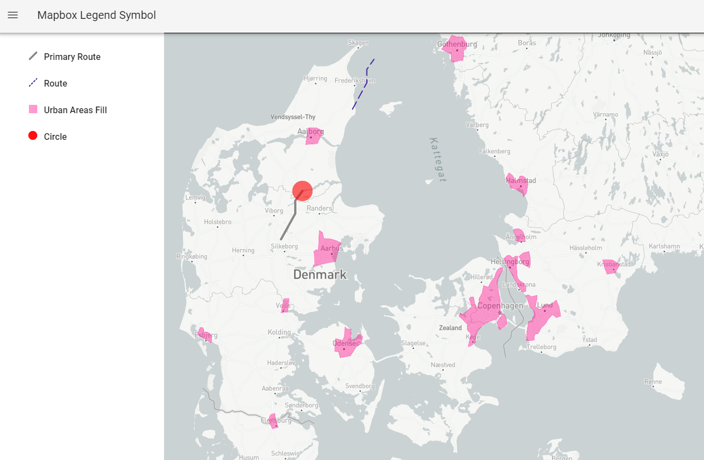

# mapbox-legend-symbol
Mapbox Lagend Symbol

This module is using source code of [orangemug/legend-symbol](https://github.com/orangemug/legend-symbol). I just made some modifications to this library.

## Installation:

```bash
npm install git+https://github.com/yogesh20kumar/mapbox-legend-symbol.git
```



## Usage
Here is an example using VUE/Nuxtjs. In the example below `map` is a instance of a mapbox-gl map and `layer` is the JSON representation of the layer you want to get a map symbol for.

```javascript
import mapboxLegendSymbol from "mapbox-legend-symbol"

```

## Contribution

Most welcome for any feedbacks and pull request to this repository.